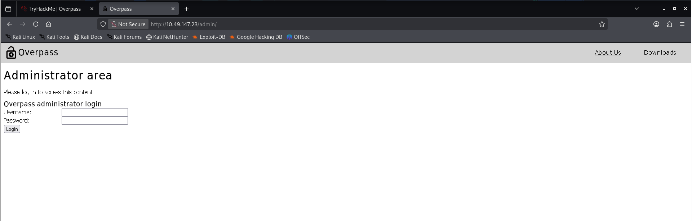
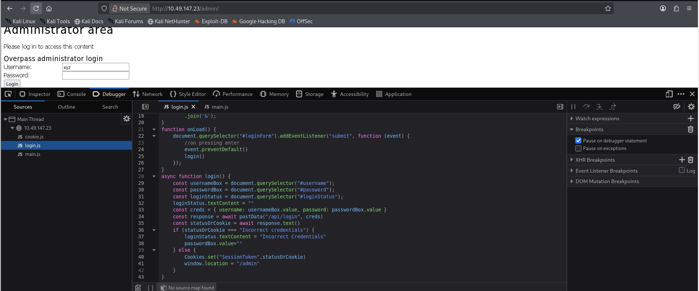

## 7. Overpass

```
nmap -sC -sV -p- 10.49.147.23
```

```
gobuster dir -u http://10.49.147.23 -w <wordlist>
```

Found pages 


We found /admin page



We found Javascript running



Now if we see, here we see a failure where it sets cookie "SessionToken", Click on add and add a SessionToken


